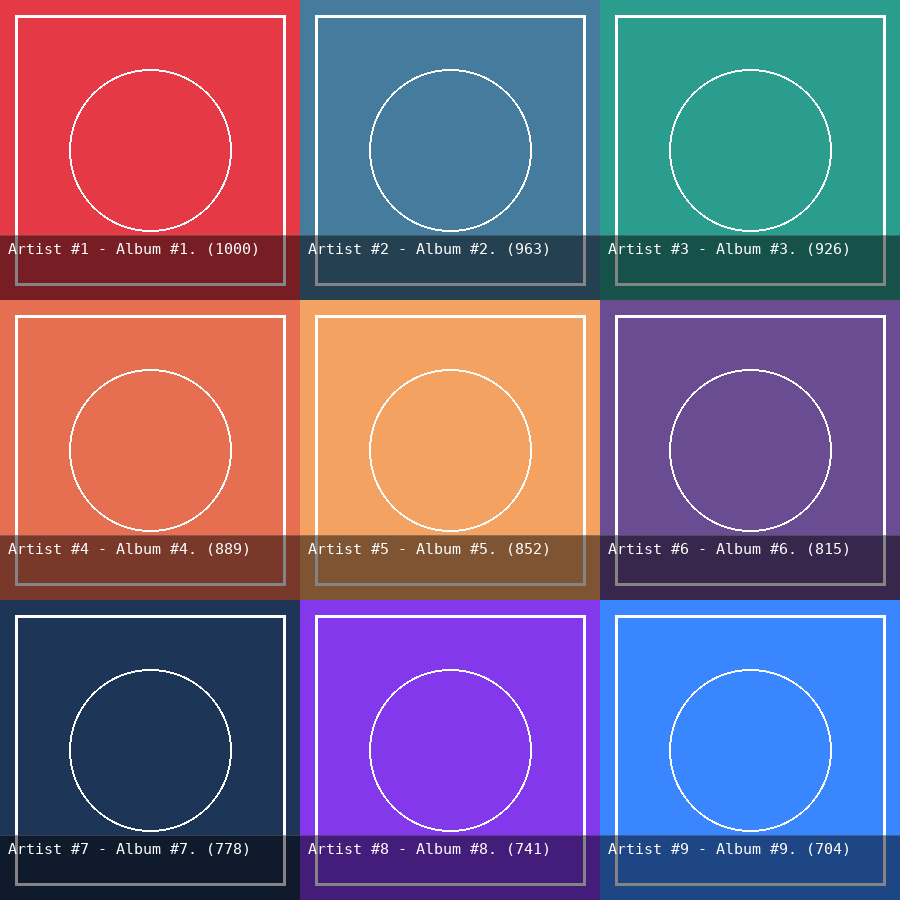
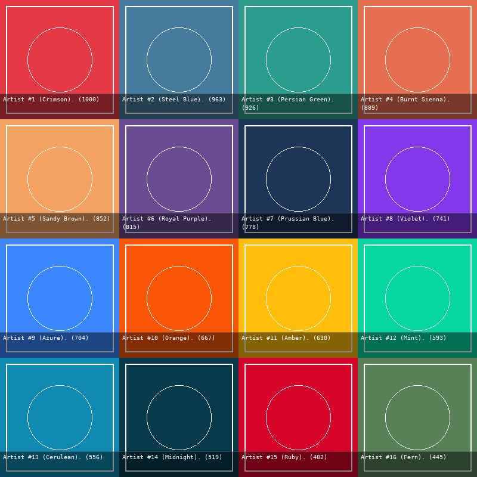
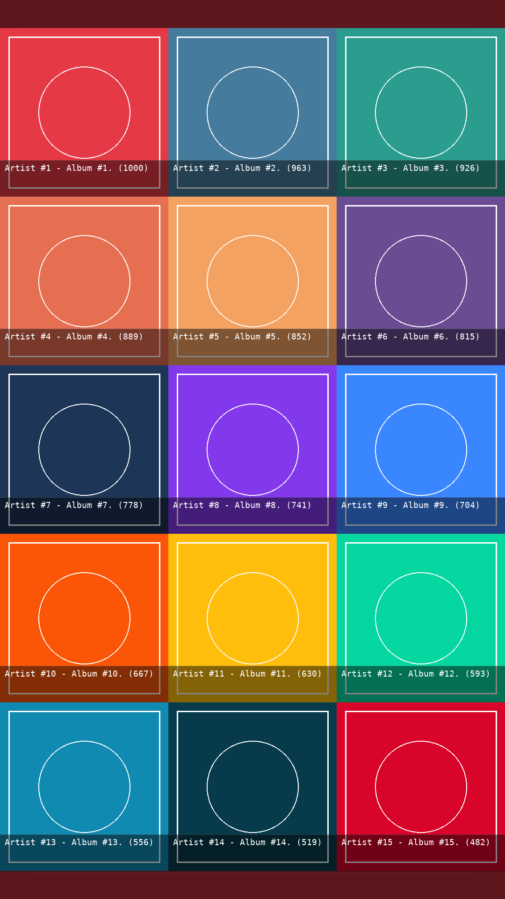
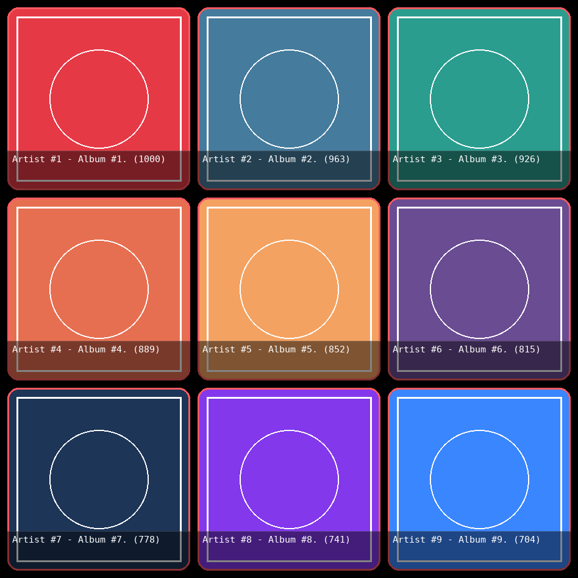
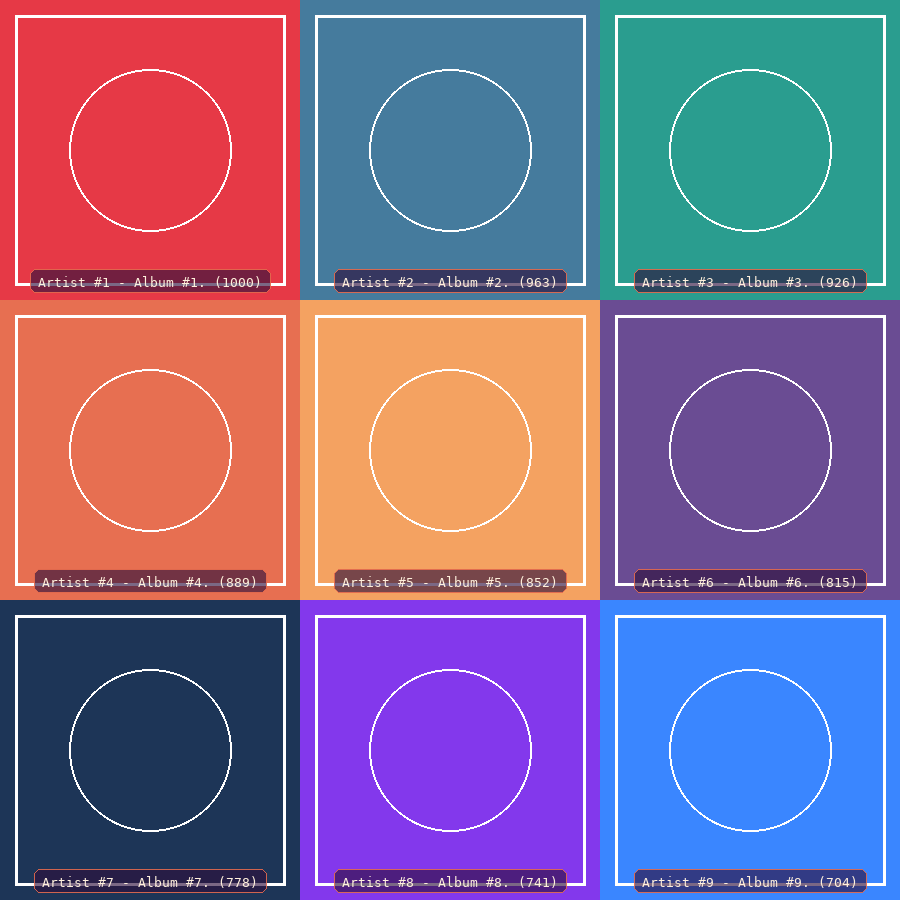
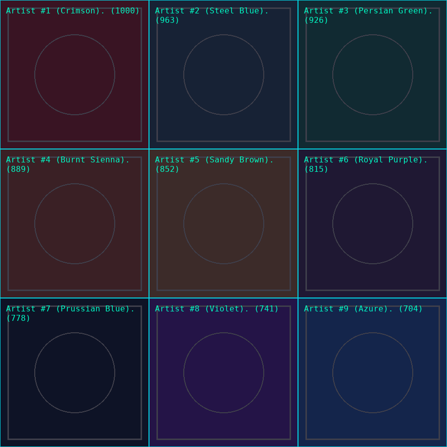
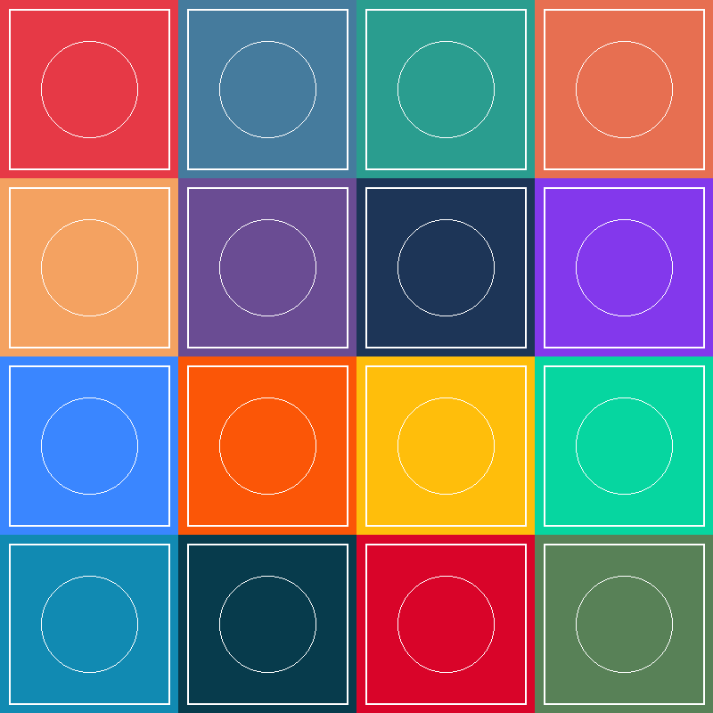
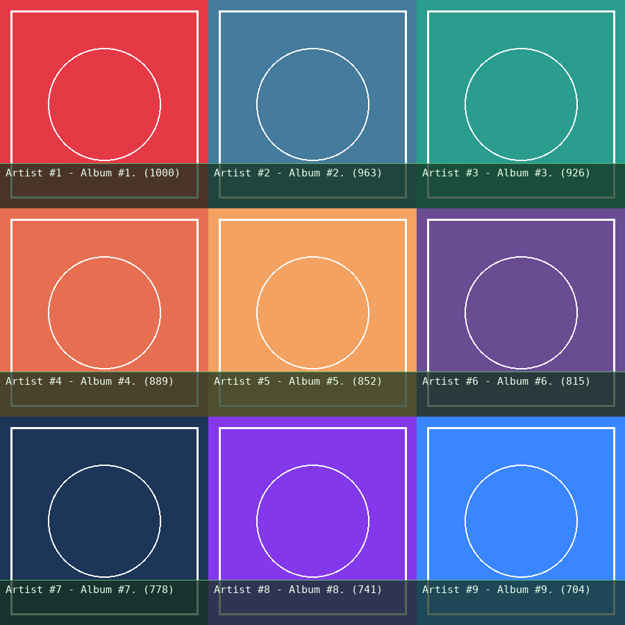
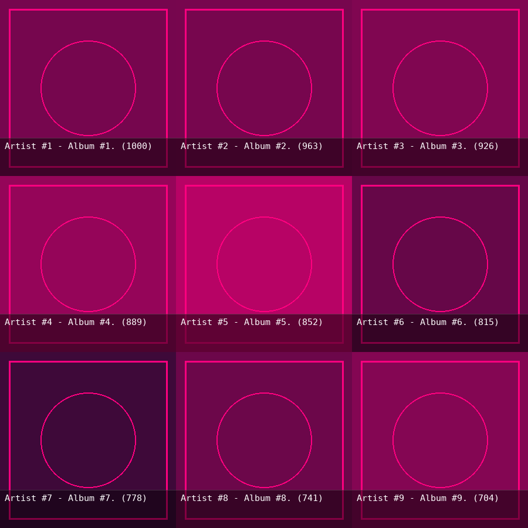

<div align="center">

# 🎵 lastfm-collage-generator

**A Python library to generate image collages from a Last.fm user's listening history.**

[](https://pypi.org/project/lastfmcollagegenerator/)
[](https://pypi.org/project/lastfmcollagegenerator/)
[](LICENSE)
[](https://github.com/astral-sh/uv)

<br>



</div>

---

## What it does

`lastfm-collage-generator` fetches top listening data from Last.fm and composites the artwork into a single image grid.

- **Albums, Artists & Tracks**: Create square or rectangular grids from `1x1` up to `20x20`.
- **Artist Images**: Supports generating grids of top artists, automatically resolving high-resolution artwork for each artist.
- **Themes & Overlays**: Choose from built-in themes (`dark`, `light`, `sunset`, `neon`, `glassmorphic`) and overlay styles (`banner`, `pill`, `full_tint`, `gradient`), or disable text for a clean grid.
- **Social Media Presets**: Ready-made dimension presets for Instagram Stories, Twitter/X headers, and wallpapers with blurred letterbox backdrops.
- **Visual Filters & Effects**: Apply duotone or custom post-processing filters across the whole collage.
- **Local SQLite Caching**: Automatically caches downloaded artwork to `~/.cache/lastfm-collage/` to speed up subsequent runs and avoid rate limits.
- **Sync & Async**: Standard `generate()` and `async generate_async()` for integration into scripts, web services, or Discord bots.

---

## 📦 Installation

```bash
pip install lastfmcollagegenerator
```

Or with [uv](https://github.com/astral-sh/uv):

```bash
uv add lastfmcollagegenerator
```

> **Note**: You need a free Last.fm API key and secret. You can create one on the [Last.fm API account page](https://www.last.fm/api/account/create).

---

## ⚡ Quickstart

```python
from lastfmcollagegenerator import CollageGenerator

# 1. Initialize with your Last.fm API credentials
generator = CollageGenerator(
    lastfm_api_key="YOUR_API_KEY",
    lastfm_api_secret="YOUR_API_SECRET",
)

# 2. Generate a 3x3 album collage for the past 7 days
image = generator.generate(
    entity="album",
    username="your_username",
    cols=3,
    rows=3,
    period="7day",
)

# 3. Save the resulting PIL Image
image.save("weekly_collage.png")
```

---

## 💡 Usage & Customization Examples

### 1. Artists and Tracks

```python
# 4x4 top artists collage over the last 3 months
artist_collage = generator.generate(
    entity="artist",
    username="your_username",
    cols=4,
    rows=4,
    period="3month",
)

# Top tracks of all time using convenience method
track_collage = generator.generate_top_tracks_collage(
    username="your_username",
    cols=3,
    rows=3,
    period="overall",
)
```



---

### 2. Social Media Presets & Wallpapers

Presets automatically configure grid dimensions, aspect ratios, and letterbox backdrops (Gaussian-blurred from your top artwork):

```python
# Instagram Story (1080x1920, 9:16)
story = generator.generate(
    entity="album",
    username="your_username",
    cols=3,
    rows=5,
    preset="instagram-story",
)
story.save("story.png")
```

Available presets: `instagram-story`, `instagram-post`, `twitter-header`, `desktop-wallpaper`, `desktop-wallpaper-4k`.



---

### 3. Tile Geometry (Borders, Rounded Corners & Spacing)

```python
# Rounded tiles with custom spacing and borders
collage = generator.generate(
    entity="album",
    username="your_username",
    cols=3,
    rows=3,
    period="1month",
    corner_radius=18,
    spacing=12,
    border_width=3,
    border_color="#FF5A5F",
)
```



---

### 4. Built-in Themes & Overlay Styles

```python
# Sunset theme with compact pill badges
sunset_collage = generator.generate(
    entity="album",
    username="your_username",
    cols=3,
    rows=3,
    theme="sunset",
    overlay_style="pill",
)

# Neon theme with full tint overlay
neon_collage = generator.generate(
    entity="artist",
    username="your_username",
    cols=3,
    rows=3,
    theme="neon",
    overlay_style="full_tint",
)

# Clean mode (pure album covers without text or overlay banners)
clean_collage = generator.generate(
    entity="album",
    username="your_username",
    cols=4,
    rows=4,
    show_text=False,
)
```

| Sunset + Pill | Neon + Full Tint | Clean Mode |
|:---:|:---:|:---:|
|  |  |  |

---

### 5. Custom Themes

Define your own color palette with the `Theme` class:

```python
from lastfmcollagegenerator import CollageGenerator, Theme

forest_theme = Theme(
    name="forest",
    overlay_bg=(20, 50, 30, 190),      # RGBA banner background
    text_color=(235, 255, 235),        # RGB text color
    accent_color=(100, 200, 120, 220), # Accent chip/pill color
)

custom_collage = generator.generate(
    entity="album",
    username="your_username",
    cols=3,
    rows=3,
    theme=forest_theme,
    overlay_style="banner",
)
```



---

### 6. Visual Filters & Duotone Effects

Apply post-processing filters across the generated collage:

```python
from lastfmcollagegenerator import CollageGenerator, DuotoneFilter

# Map image luminance to a two-color duotone palette
duotone = DuotoneFilter(
    black_color="#0F0C29",
    white_color="#FF007F",
)

duotone_collage = generator.generate(
    entity="album",
    username="your_username",
    cols=3,
    rows=3,
    filters=duotone,
)
```



---

### 7. Async Generation (Discord Bots / Web APIs)

```python
import asyncio
from lastfmcollagegenerator import CollageGenerator

async def main():
    generator = CollageGenerator("YOUR_API_KEY", "YOUR_API_SECRET")
    image = await generator.generate_async(
        entity="album",
        username="your_username",
        cols=3,
        rows=3,
        period="7day",
    )
    image.save("async_collage.png")

asyncio.run(main())
```

---

### 8. Image Export & In-Memory Streaming

Use `export_image()` for file export or stream directly to in-memory buffers for web frameworks:

```python
import io
from lastfmcollagegenerator import export_image

# 1. Export to modern WebP (optimized quality)
export_image(image, "output/collage.webp", quality=85)

# 2. Export to JPEG (automatically flattens alpha onto black background)
export_image(image, "output/collage.jpg", quality=90)

# 3. Stream in-memory for FastAPI / Flask / Discord bot response
buffer = io.BytesIO()
image.save(buffer, format="PNG")
buffer.seek(0)
raw_png_bytes = buffer.getvalue()
```

---

## 📖 Parameters Reference (`generate`)

| Parameter | Type | Default | Description |
|---|---|---|---|
| **`entity`** | `str` | *required* | `"album"`, `"artist"`, or `"track"`. |
| **`username`** | `str` | *required* | Last.fm user account name. |
| **`cols`** | `int` | *required* | Number of columns (`1` to `20`). |
| **`rows`** | `int` | *required* | Number of rows (`1` to `20`, max 400 total tiles). |
| **`period`** | `str` | `"overall"` | Time window: `"7day"`, `"1month"`, `"3month"`, `"6month"`, `"12month"`, `"overall"`. |
| **`preset`** | `Optional[str]` | `None` | Preset dimensions (e.g. `"instagram-story"`, `"twitter-header"`). |
| **`theme`** | `str` / `Theme` | `"dark"` | Visual color scheme: `"dark"`, `"light"`, `"glassmorphic"`, `"sunset"`, `"neon"`. |
| **`overlay_style`** | `str` | `"banner"` | Overlay layout: `"banner"`, `"pill"`, `"full_tint"`, `"gradient"`, `"clean"`. |
| **`show_text`** | `bool` | `True` | Whether to render title and playcount text. |
| **`show_playcount`** | `bool` | `True` | Whether to include the scrobble count. |
| **`tile_size`** | `Optional[int]` | `None` *(Auto)* | Custom tile size in pixels (`50` to `600`). Auto-scaled if omitted. |
| **`corner_radius`** | `int` | `0` | Rounded corner radius in pixels. |
| **`border_width`** | `int` | `0` | Border stroke width in pixels. |
| **`border_color`** | `Optional[Union[str, tuple]]` | `None` | Border color as hex string (`"#FF5A5F"`) or RGB(A) tuple. |
| **`spacing`** | `int` | `0` | Margin between tiles in pixels. |
| **`filters`** | `Optional[ImageFilter]` | `None` | Image filter (e.g. `DuotoneFilter`) or `VisualEffectPipeline`. |
| **`cache_dir`** | `Optional[str]` | `None` | Custom path for SQLite cache (defaults to `~/.cache/lastfm-collage/`). |

---

## 🤖 GitHub Actions

The repository includes an `action.yml` to generate collages automatically within GitHub Actions workflows (e.g. to update a profile README):

```yaml
- uses: paurieraf/lastfm-collage-generator@v1.4.0
  with:
    username: ${{ secrets.LASTFM_USERNAME }}
    api-key: ${{ secrets.LASTFM_API_KEY }}
    api-secret: ${{ secrets.LASTFM_API_SECRET }}
    output-path: weekly-recap.png
```

---

## 🤝 Contributing

Contributions are welcome! See [CONTRIBUTING.md](CONTRIBUTING.md) for local development setup, testing workflows, and guidelines.

---

## 📄 License

This project is licensed under the [MIT License](LICENSE).
